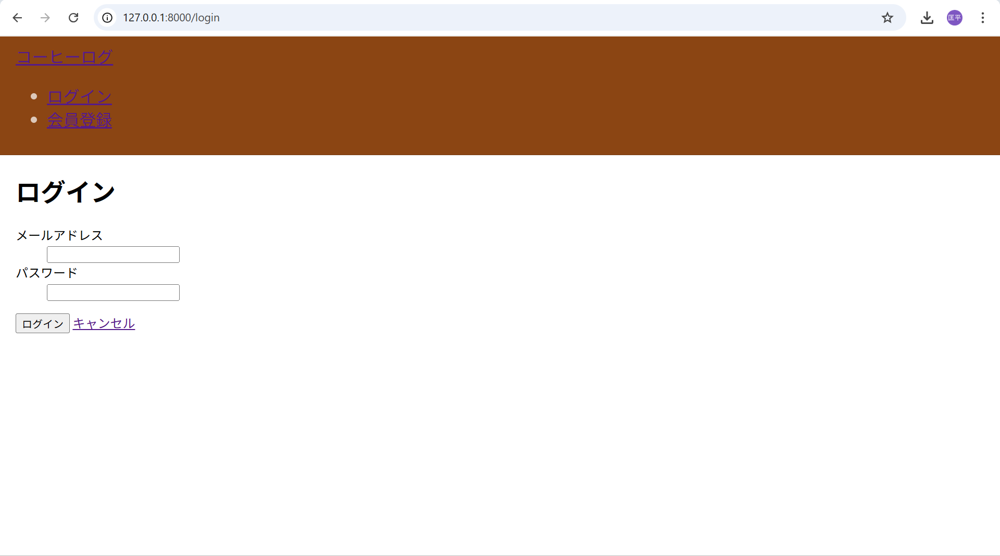
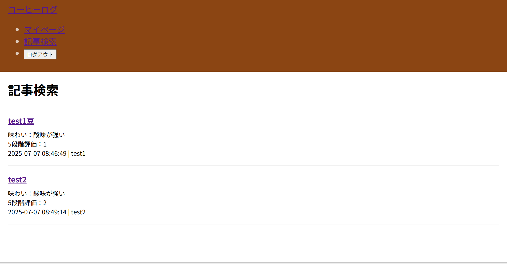
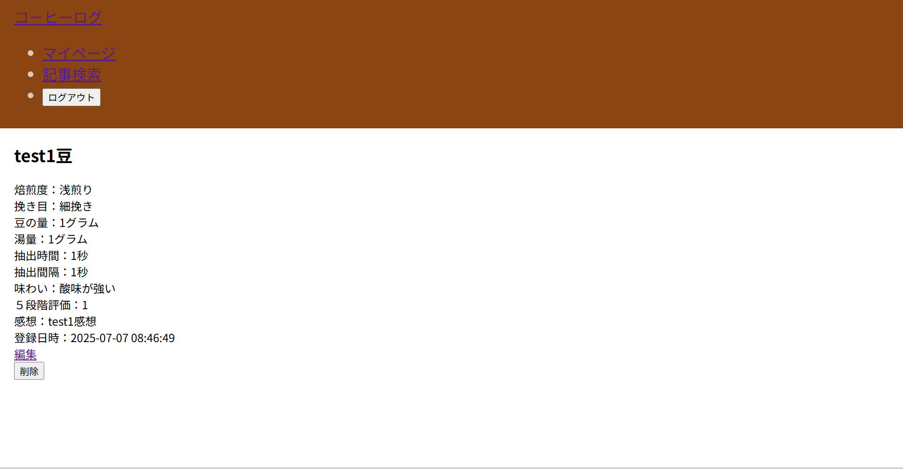
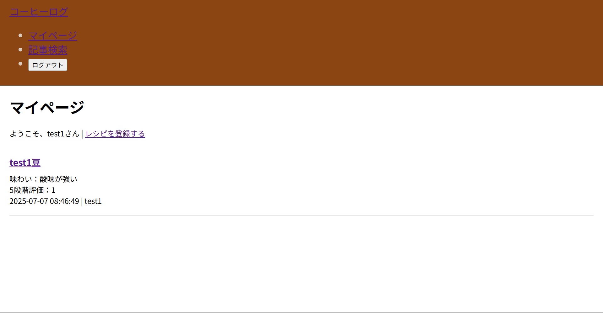
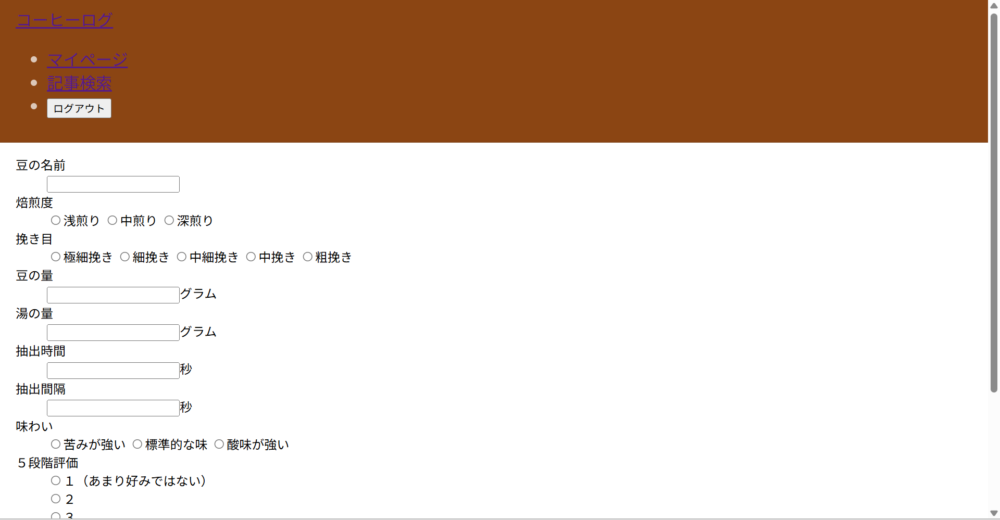
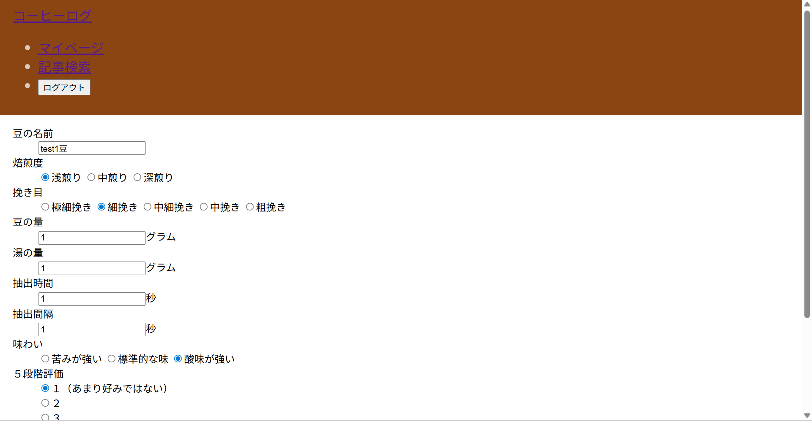

#CoffeeRecord-app
laravelで開発した、コーヒーレシピの記録とドリップのサポートをするアプリです。

##実装済みの機能
・レシピの登録、編集、削除
・ユーザーと登録したレシピの紐づけ
・自分以外のユーザーが登録したレシピの閲覧

##実装予定の機能
・豆の名前によるレシピの検索
・５段階評価や登録日時による並び替え
・抽出時に使用する音声ガイドつきタイマー

##スクリーンショット

##使用技術
・laravel
・php
・mysql
・java script

##ローカルでの動作方法
bash
git clone https://github.com/ars0611/CoffeeRecord-app.git //github上のリポジトリを自分のpc上にコピー
cd coffee //フォルダcoffeeに移動
composer install //必要なライブラリのインストール
php artisan migrate //データベースにテーブルを作成
php artisan serve //サーバーを起動 アクセスする際、末尾に/coffee_recordsを追加（welcome.blade.phpの作成がまだなため）

##今後の作業
・未実装の機能の実装
・アプリ概要を示すwelcome.blade.phpの作成
・おすすめのレシピや道具名を紹介する初心者向けのページの作成
・各bladeファイル、cssファイルの手直し